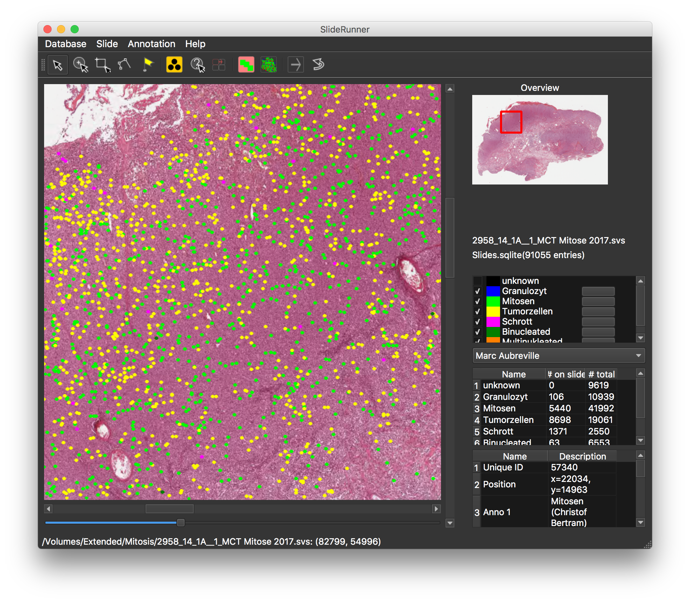
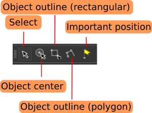
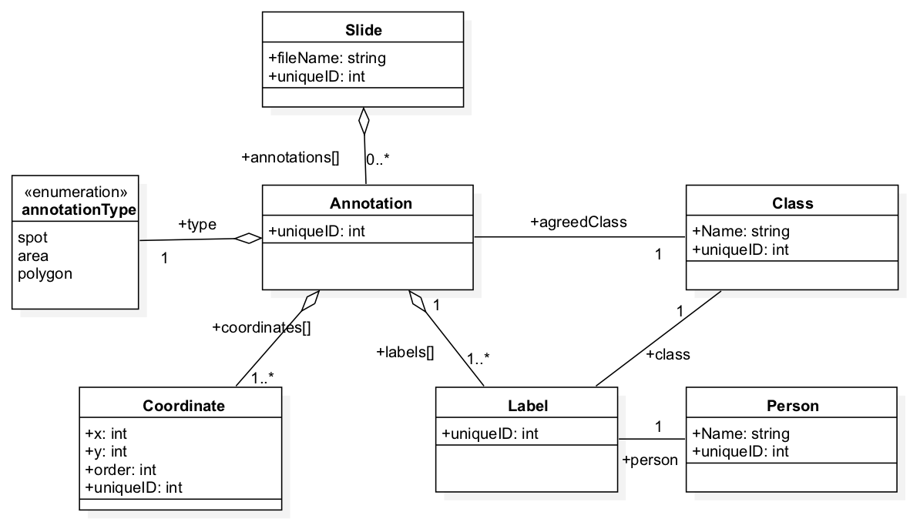

# SlideRunner 

*SlideRunner* is a tool for massive cell annotations in whole slide images.

It has been created in close cooperation between the [Pattern Recognition Lab](https://www5.cs.fau.de), Friedrich-Alexander-Universität Erlangen-Nürnberg and the [Institute of Veterenary Pathology](http://www.vetmed.fu-berlin.de/einrichtungen/institute/we12/index.html), Freie Universität Berlin.

If you use the software for research purposes, please cite our paper:

> M. Aubreville, C. Bertram, R. Klopfleisch and A. Maier (2018) SlideRunner - A Tool for Massive Cell Annotations in Whole Slide Images. In: Bildverarbeitung für die Medizin 2018. Springer Vieweg, Berlin, Heidelberg, 2018. pp. 309-314. [link](https://www.springerprofessional.de/sliderunner/15478976) [arXiv:1802.02347](https://arxiv.org/abs/1802.02347) 

Please find the authors webpage at: https://www5.cs.fau.de/~aubreville/

## Download and Installation 

For Windows 10 and Mac OS X, we provide a binary file, that you can download here:

| Operating System | Version | Download link|
|---|---|---|
| Windows 10 | V. 1.15.3 | [link](https://github.com/maubreville/SlideRunner/raw/master/dist/SlideRunner.exe) |
|Mac OS X (10.14) | V 1.15.3 | [link](https://github.com/maubreville/SlideRunner/raw/master/dist/SlideRunner.app.zip)|

## Installation - Source

SlideRunner is written in Python 3, so you will need a Python 3 distribution like e.g. Anaconda (https://www.anaconda.com/download/) to run it. Further, you need to install
OpenSlide (http://openslide.org/download/).

### Install using PIP

After OpenSlide is installed, we provide a convenient installation by using pip. On Linux or Mac, simply run:

>sudo pip install -U SlideRunner

On windows, pip should install without sudo (untested):

>pip install -U SlideRunner

### Installation from repository

You need to clone this repository:

>git clone https://github.com/maubreville/SlideRunner

In order to use the automated installation process, you need to have setuptools installed.
>pip install -U setuptools

The installation procedure is then as easy as:
>cd SlideRunner

>python setup.py install

To run, the following libraries and their dependencies will be installed:

Library           | version           |  link             
------------------|-------------------|-------------------
PyQT5             | >= 5.6.0         | https://pyqt.sourceforge.net/
numpy             | >= 1.13           | https://www.numpy.org
cv2 (OpenCV3)     | >= 3.1.0          | https://opencv.org
sqlite3           | >= 2.6.0          | https://www.sqlite.org
openslide         | >= 1.1.1          | https://www.openslide.org

## Screenshots

## Usage

SlideRunner features a number of annotation modes. 

**View/Select**

This mode is meant for browsing/screening the image, without the intention to add annotations.

**Object center annotation**

In this mode, annotations of object centers (e.g. cells) can be made with one click only. Select the class to annotate by clicking the button next to it in the class list or press 
the key corresponding to the number in the list of annotations (e.g. key **1** for the first class entry). Objects annotated in this mode are displayed with a circle having a diameter of 50 pixels in full resolution, and scaled appropriately when not viewed in full resolution.

**Outline annotation (rectangular)**
This mode provides a rectangular annotation tool, that can be used to annotate rectangular patches on the image.

**Outline annotation (circle) (new in ver 1.8.0)**
This mode provides a circle annotation tool, that can be used to annotate circular patches on the image.

**Outline annotation (polygon)**
This mode creates a polygon, i.e. a connected line of points corresponding to a single annotation object. This can be handy for cellular structures or tissue types.

**Annotation of important position**
Important positions are annotations shown with a cross in a circle. The size of this annotation does not change depending on the zooming level. An important position does not
have a class attached to it.

## News

Starting with Version 1.10.0, we have a multi-thread-compatible plug-in interface. Up to now, documentation is not yet available. As examples, three plug-ins are provided. 

## Databases

The MITOS2012 [http://ludo17.free.fr/mitos_2012/], MITOS-ATYPIA-2014 [https://mitos-atypia-14.grand-challenge.org/] and TUPAC16 [http://tupac.tue-image.nl] data sets are provided as SlideRunner database in the repository. Please download the original images (*.bmp, *.tif) in order to use them.

## Tools

Mingrui Jiang has written a tool to extract patches around ROIS. Find it here: https://github.com/mingrui/SlideRunner-ROI-Patch-Maker

## Plugins

There are currently three plug-ins available:

- OTSU threshold: A simple OTSU threshold plugin. Positive pixels are shown in green color.
- PPC: Positive Pixel Count, as in: Olson, Allen H. "Image analysis using the Aperio ScanScope." Technical manual. Aperio Technologies Inc (2006).
- Macenko normalization: Image-based normalization using the method of Macenko et al. [link](https://ieeexplore.ieee.org/document/5193250/)

## Database structure

The major entity of our database model is the annotation. Each annotation can have multiple coordinates, with their respective x and y coordinates, and the order they were drawn (for polygons). Further, each annotation has a multitude of labels that were given by one person each and are belonging to one class, respectively. 

## Troubleshotting

**Programm won't start, error message: Missing or nonfunctional package openslide: Couldn't locate OpenSlide dylib. Is OpenSlide installed?**

Unfortunately, the OpenSlide binary libraries can't be fetched using pip. You need to install OpenSlide libraries (and dependencies). See http://openslide.org/download/ for more.

